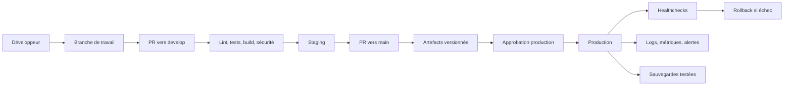

# Audit DevOps — TransReal

Date de référence : 4 octobre 2026  
Périmètre : nouveau dépôt `F:\Real_projects\TransReal`

## Synthèse exécutive

TransReal démarre dans un dépôt neuf, sans code applicatif, historique distant ni infrastructure. Il n'existe donc pas de dette applicative à corriger, mais aucun build, test, conteneur ou déploiement ne peut encore être validé. Le socle de gouvernance et de sécurité du dépôt a été créé sans présumer de la stack future.

La priorité suivante est une décision d'architecture courte et explicite, suivie de l'initialisation verticale du premier composant avec son lint, ses tests, son build, son healthcheck et sa CI dans la même Pull Request.

## État du projet au début de l'audit

| Élément | Constat initial |
| --- | --- |
| Arborescence | Dossier vide |
| Git | Non initialisé |
| Remote GitHub | Absent |
| Branches | Absentes |
| Dernier commit | Aucun |
| Frontend / backend / agents | Absents |
| Base de données | Non choisie |
| Configuration | Absente |
| Tests | Absents, car aucun code |
| Docker / Compose | Absents |
| CI/CD | Absente |
| Documentation | Absente |
| Secrets versionnés | Aucun fichier à analyser initialement |

## Architecture actuelle

Après initialisation, le dépôt contient uniquement :

```text
TransReal/
├── .github/
│   ├── ISSUE_TEMPLATE/
│   ├── workflows/
│   └── PULL_REQUEST_TEMPLATE.md
├── docs/devops/
├── scripts/
├── .editorconfig
├── .env.example
├── .gitattributes
├── .gitignore
├── CHANGELOG.md
├── CODE_OF_CONDUCT.md
├── CONTRIBUTING.md
├── DEVOPS_AUDIT.md
├── README.md
└── SECURITY.md
```

Il n'existe pas encore d'architecture applicative à auditer.

## Technologies détectées

| Technologie | Statut | Preuve |
| --- | --- | --- |
| Git | Présent | Dépôt initialisé localement |
| PowerShell 7 | Utilisé pour l'outillage | `scripts/verify-repository.ps1` |
| GitHub Actions | Socle présent | `.github/workflows/repository-guard.yml` |
| Frontend | Non détecté | Aucun manifeste ou source |
| Backend | Non détecté | Aucun manifeste ou source |
| Base de données | Non détectée | Aucune configuration |
| Docker | Non détecté | Aucun Dockerfile ou fichier Compose |

PowerShell n'est pas un choix de runtime applicatif. Il sert uniquement de contrôle portable sur les runners GitHub et les postes Windows.

## Problèmes et risques détectés

### P0 — Critique

- Aucun secret n'était exposé puisque le dépôt était vide.
- Le dépôt ne possédait aucun garde-fou contre l'ajout de `.env`, clés privées ou fichiers de credentials. Ce point est corrigé par `.gitignore`, `.env.example` et le contrôle de dépôt.

### P1 — Important

- La stack applicative, les versions de runtimes et les contrats entre composants ne sont pas définis.
- Aucun remote GitHub n'est configuré ; protections de branches, secret scanning privé et règles de merge ne peuvent pas être appliqués.
- Aucun propriétaire réel n'est connu ; un `CODEOWNERS` fiable ne peut pas être créé.
- Aucun test, lint ou build applicatif n'existe.
- La cible d'hébergement EPT, le registre d'images, les DNS et la gestion des secrets ne sont pas définis.
- Les objectifs de disponibilité, rétention, RPO et RTO ne sont pas définis.

### P2 — Amélioration

- Les labels et le Kanban doivent être créés après création du repository GitHub.
- Dependabot doit être activé lorsque les premiers manifestes de dépendances existent.
- Les scans SAST, dépendances et conteneurs doivent être ajoutés avec la stack correspondante.
- Les conventions de logs, métriques et traces doivent être implémentées dans chaque service.

### P3 — Optionnel

- Automatisation de release et génération de notes à partir des Conventional Commits.
- Tests de charge planifiés et exercices automatisés de restauration.
- Environnements éphémères par Pull Request si l'infrastructure le justifie.

## Risques DevOps

| Risque | Probabilité | Impact | Traitement |
| --- | --- | --- | --- |
| Choix technique prématuré | Moyen | Élevé | ADR avant scaffolding |
| Secret ou topologie sensible dans Git | Moyen | Critique | Ignore, revue, scan de secrets à ajouter |
| CI fictive ou divergente du local | Moyen | Élevé | Une commande partagée par local et CI |
| Déploiement sans rollback | Moyen | Critique | Version immuable, healthcheck, procédure testée |
| Perte de données de supervision | Moyen | Élevé | RPO/RTO, sauvegardes et tests de restauration |
| Plateforme non supervisée | Moyen | Élevé | SLI/SLO, métriques et alertes de la plateforme |

## Fichiers initialement manquants

Les fichiers de gouvernance de base ont été ajoutés. Restent volontairement absents :

- manifestes applicatifs (`package.json`, `pom.xml`, `pyproject.toml`, etc.) ;
- Dockerfiles et Compose ;
- configuration Dependabot par écosystème ;
- CI applicative ;
- `CODEOWNERS` avec comptes réels ;
- `LICENSE`, en attente d'une décision explicite du propriétaire du projet ;
- manifests de déploiement ;
- migrations de base de données.

Ces fichiers doivent découler de décisions réelles, non de suppositions.

## Recherche de secrets

Le dépôt vide ne contenait aucun secret à l'ouverture. Le contrôle initial bloque les noms de fichiers à haut risque suivis par Git et impose des valeurs sensibles vides dans `.env.example`.

Limite connue : ce contrôle n'est pas un scanner de secrets historique ou entropique. Après création du remote, activer GitHub Secret Scanning si disponible et ajouter un outil dédié, avec une configuration validée et un traitement clair des alertes.

## Tests et scripts de build

Aucun code n'existe ; aucun test, lint ou build applicatif n'est donc possible. La seule commande valide est :

```powershell
pwsh ./scripts/verify-repository.ps1
```

Toute première PR applicative devra fournir ses commandes reproductibles et les brancher à la CI.

## Docker et environnements

Créer un Dockerfile maintenant obligerait à inventer un runtime, un port et une commande de démarrage. Docker est donc reporté jusqu'au premier service exécutable. Les images futures devront utiliser des versions maîtrisées, un build multi-stage lorsque pertinent, un utilisateur non-root, un healthcheck et aucun secret embarqué.

Environnements cibles : `development`, `testing`, `staging`, `production`. Les détails figurent dans `docs/devops/environment-variables.md`.

## CI/CD

Le workflow initial exécute le même contrôle de dépôt que les développeurs. La CI évoluera par composant et n'utilisera que des commandes présentes et testées localement.

Le CD est reporté jusqu'à confirmation de l'hébergement. La chaîne cible reste portable : artefact ou image immuable, staging, validation, approbation production, healthcheck et rollback.

## Architecture DevOps cible



L'architecture applicative cible est détaillée dans `docs/devops/architecture.md`.

## Roadmap priorisée

### P0 — Réalisé ou immédiat

- [x] Initialiser Git sur `main`.
- [x] Ignorer les secrets, caches et artefacts usuels.
- [x] Créer un modèle de variables sans valeur sensible.
- [x] Ajouter un contrôle reproductible des fichiers sensibles connus.
- [x] Documenter la politique de signalement privé.

### P1 — Prochaine étape

- [ ] Créer le repository GitHub et configurer `origin`.
- [ ] Créer les équipes ou identifier les propriétaires réels, puis ajouter `CODEOWNERS`.
- [ ] Protéger `main` et `develop` selon `docs/devops/github-configuration.md`.
- [ ] Rédiger une ADR de choix de stack et figer les versions de runtime.
- [ ] Initialiser le premier parcours vertical avec lint, tests, build et healthcheck.
- [ ] Ajouter la CI applicative correspondante.
- [ ] Définir la cible d'hébergement, le gestionnaire de secrets, les RPO/RTO et les SLO.

### P2 — Après le premier composant

- [ ] Conteneuriser les services réels et créer Compose pour le développement.
- [ ] Configurer Dependabot pour les écosystèmes détectés.
- [ ] Ajouter SAST, scan de dépendances, scan de secrets dédié et scan d'images.
- [ ] Déployer en staging avec migrations contrôlées et smoke tests.
- [ ] Implémenter logs structurés, métriques d'exploitation et alertes.
- [ ] Automatiser et tester sauvegarde et restauration.

### P3 — Maturité

- [ ] Automatiser releases et changelog.
- [ ] Ajouter tests de charge, chaos ciblé et exercices de reprise.
- [ ] Évaluer les environnements éphémères et la signature d'artefacts.

## Conclusion

Le dépôt possède désormais un socle sûr et cohérent avec son état réel. La prochaine décision bloquante n'est pas technique au sens CI : il faut choisir la stack et la cible d'hébergement avec les contraintes EPT, puis livrer un premier composant opérationnel de bout en bout.
