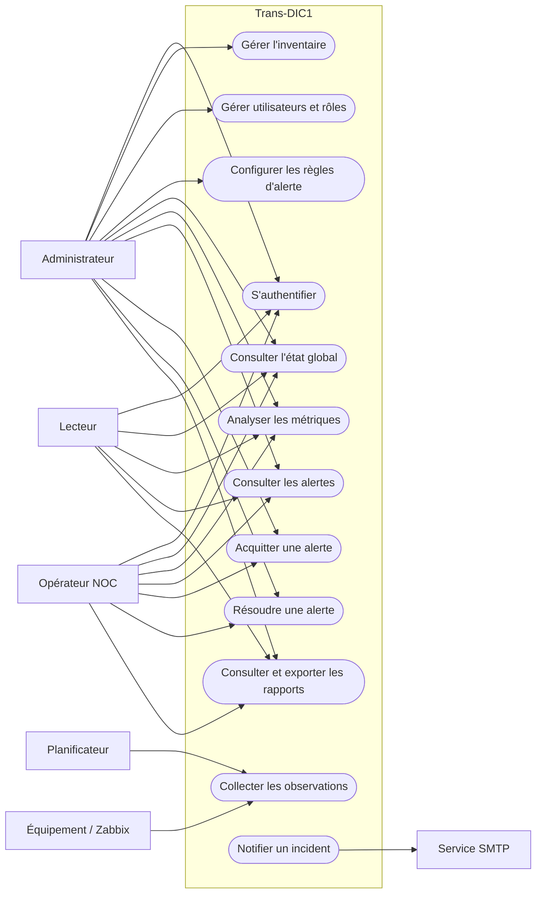
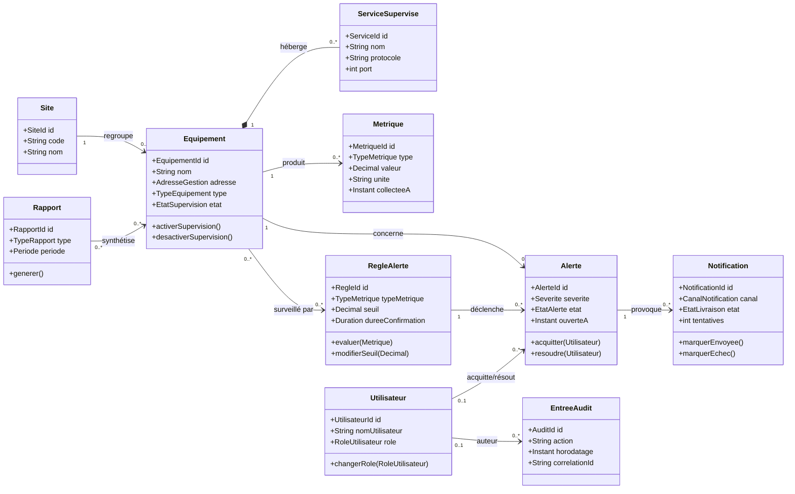
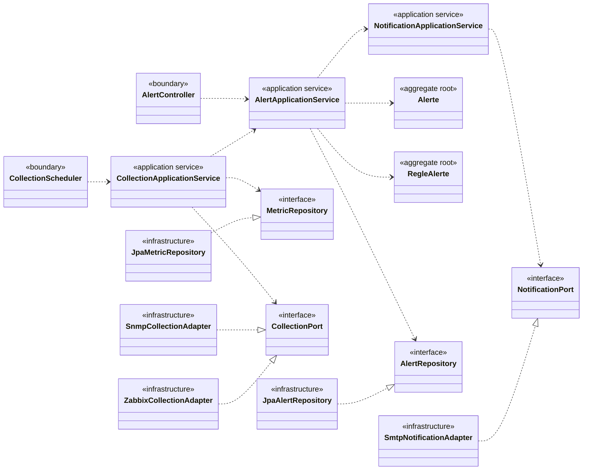
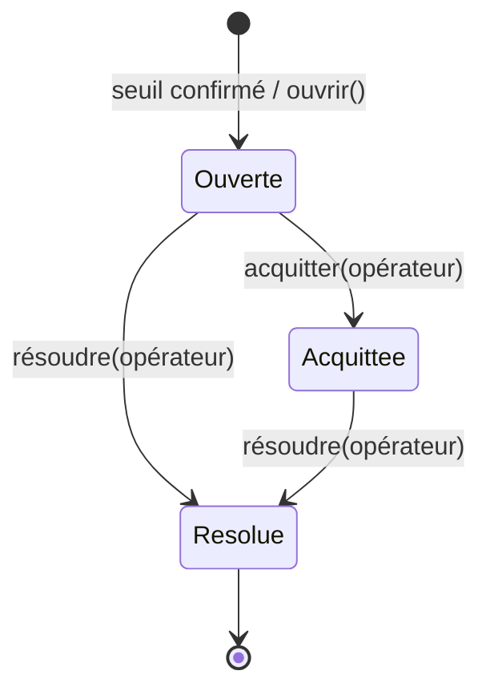
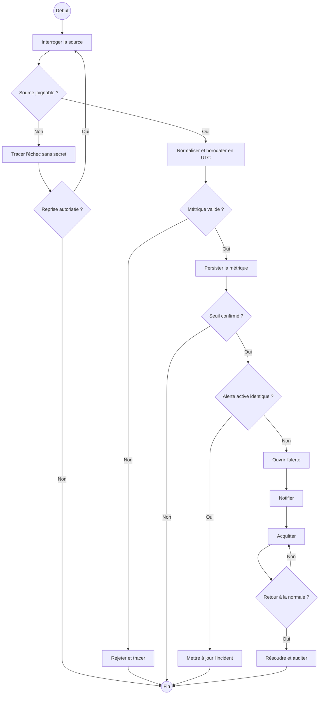
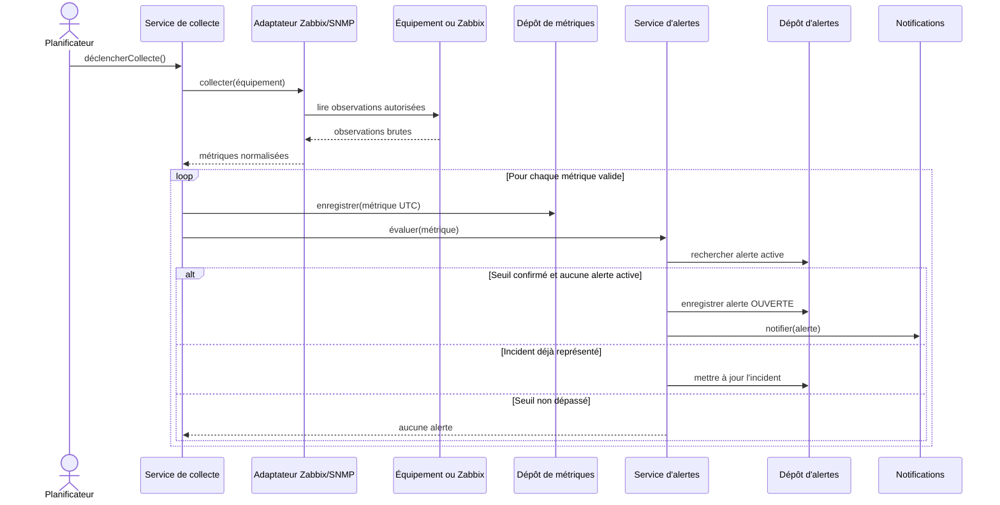
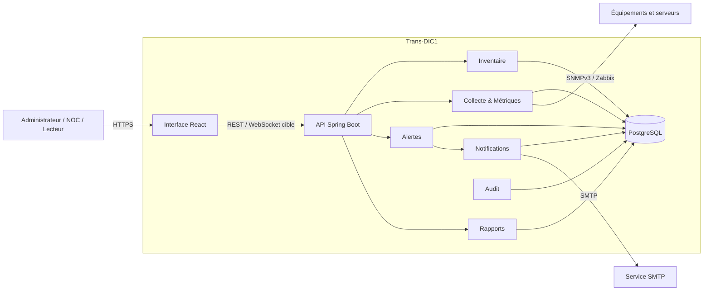
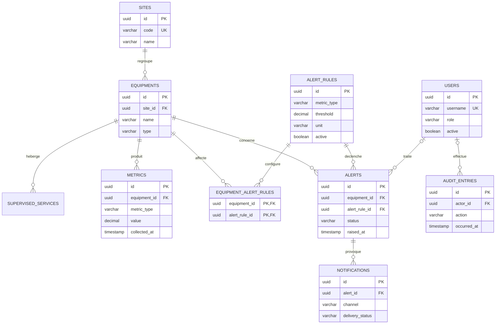

# Galerie des diagrammes — Trans-DIC1

> Les vues métier et d'architecture ci-dessous représentent la cible recommandée, sauf le déploiement local explicitement indiqué comme actuel.

Les explications détaillées de chaque acteur, cas d'utilisation et classe sont disponibles dans [`EXPLICATIONS.md`](EXPLICATIONS.md).

> **Mise à jour après validation métier :** le premier diagramme ci-dessous est conservé comme proposition initiale. Les cas d'utilisation validés le 6 octobre 2026 sont disponibles dans [`USE-CASES-VALIDES.md`](USE-CASES-VALIDES.md) et dans les trois fichiers `validated-global-use-cases.mmd`, `monitoring-use-cases.mmd` et `administration-use-cases.mmd`.

## 1. Cas d'utilisation global

## 2. Modèle conceptuel métier

## 3. Modèle de conception

## 4. Cycle d'état d'une alerte

## 5. Activité — cycle d'un incident

## 6. Séquence — collecte et ouverture d'alerte

## 7. Diagramme de composants

## 8. Déploiement local actuel

## 9. ERD cible

## Fichiers sources

Les versions complètes et autonomes se trouvent dans [`docs/architecture/diagrams`](diagrams/README.md).
