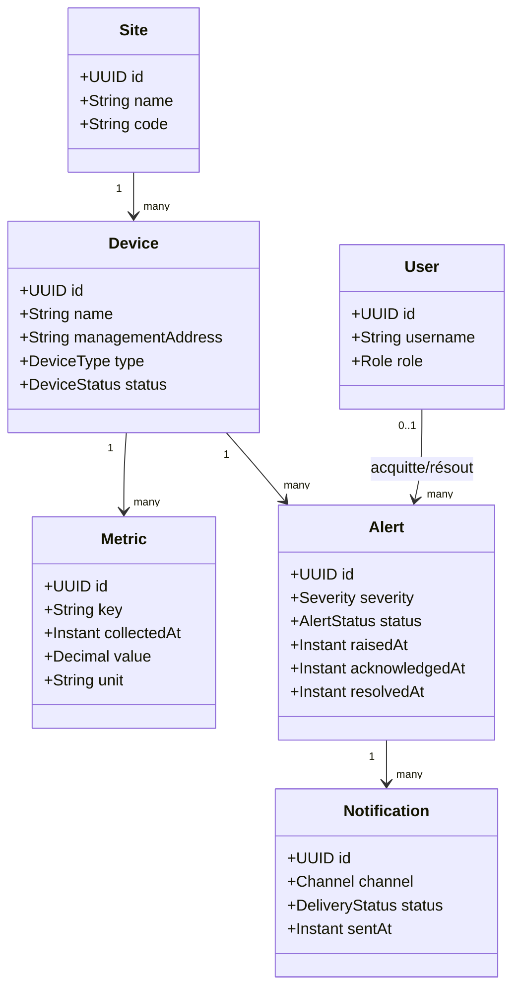
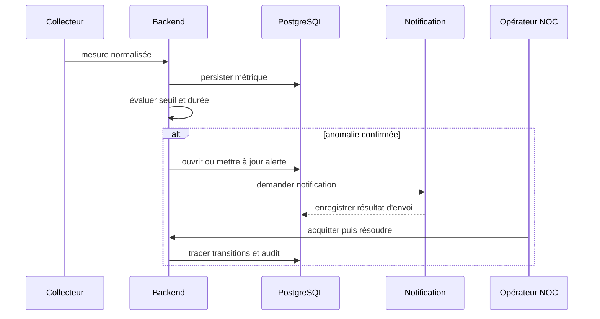

# Modèle de domaine initial

Ce document matérialise les principaux objets du backlog. Il ne remplace pas les migrations : il fixe le vocabulaire partagé avant l'implémentation des entités.

## Cycle d'une alerte

## Invariants initiaux

- Une métrique appartient à exactement un équipement et porte un horodatage UTC.
- Une seule alerte ouverte existe pour un même équipement, une même règle et une même occurrence.
- L'acquittement et la résolution enregistrent l'auteur et la date.
- La notification ne contient jamais de secret de collecte.
- Les suppressions fonctionnelles sensibles sont auditées.
