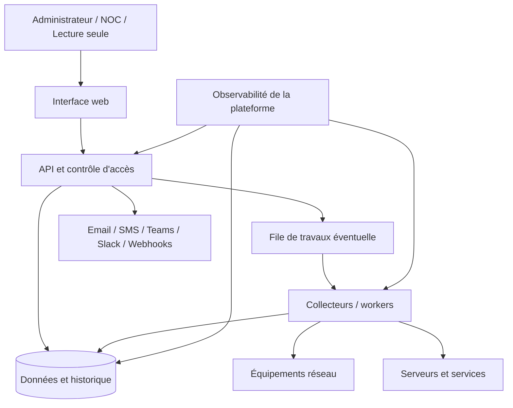

# Architecture cible

## Principes

- Séparer interface, API, collecte et traitement afin d'isoler les charges et privilèges.
- Garder les collecteurs dans des zones réseau explicitement autorisées.
- Ne jamais exposer les credentials SNMP ou équipements au navigateur.
- Utiliser des contrats versionnés entre composants.
- Concevoir chaque service avec healthcheck, logs structurés et métriques.
- Déployer des artefacts immuables identiques entre staging et production.

## Vue logique proposée

La file de travaux est conditionnelle : elle ne doit être introduite que si les volumes, délais ou besoins de reprise le justifient.

## Décisions à prendre avant scaffolding

Créer une ADR pour chaque décision structurante :

1. runtime et framework frontend ;
2. runtime et framework backend ;
3. base de données et stratégie de séries temporelles ;
4. protocole des collecteurs et exécution des tâches ;
5. authentification, autorisation et audit ;
6. cible d'hébergement et contraintes réseau EPT ;
7. gestion des secrets ;
8. objectifs SLO, RPO et RTO.

## Critères du premier parcours vertical

Le premier incrément doit être minimal mais exploitable :

- un endpoint de santé ;
- une métrique synthétique ou un équipement fictif ;
- stockage ou réponse contrôlée ;
- affichage simple ;
- logs sans secret ;
- tests, lint et build ;
- exécution locale documentée ;
- CI utilisant exactement les mêmes commandes.

