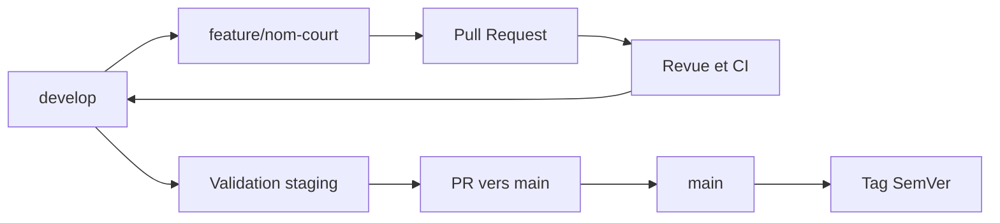

# Workflow Git

## Branches

- `main` : production et releases stables.
- `develop` : intégration de la prochaine version.
- Branches courtes depuis `develop` : `feature/*`, `fix/*`, `refactor/*`, `docs/*`, `test/*`, `chore/*`, `ci/*`.
- `hotfix/*` part de `main`, revient vers `main`, puis est reportée dans `develop`.

## Flux normal

## Commits et versions

Les commits suivent Conventional Commits. Les releases suivent `MAJOR.MINOR.PATCH` : incompatibilité, fonctionnalité compatible, puis correction compatible.

## Conditions de merge

- PR à jour et centrée sur un objectif ;
- contrôles requis réussis ;
- conversations résolues ;
- une approbation lorsque plusieurs mainteneurs existent ;
- squash merge recommandé pour les branches de travail ;
- suppression de la branche après merge.

